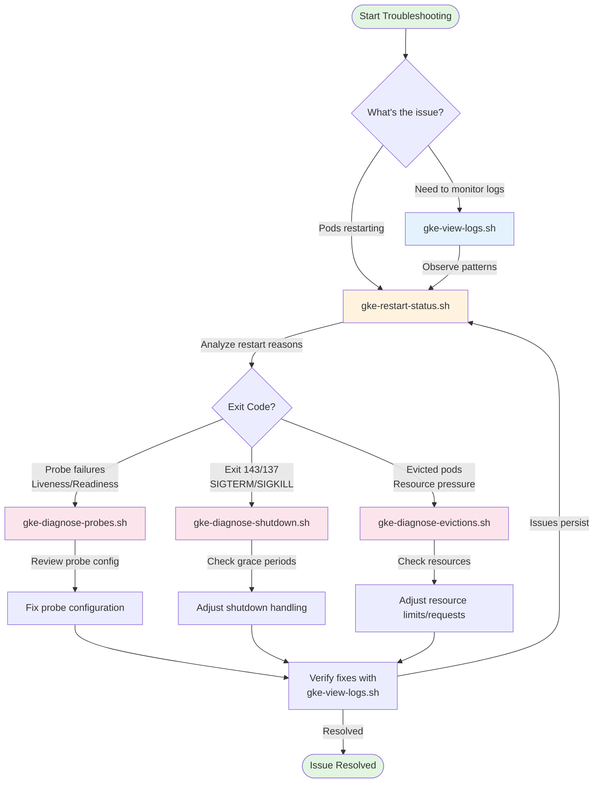

# GKE Utility Scripts

A collection of scripts for managing and diagnosing Google Kubernetes Engine (GKE) clusters.

## Table of Contents

- [About](#about)
- [Prerequisites](#prerequisites)
- [Scripts](#scripts)
  - [gke-view-logs.sh](#gke-view-logssh)
  - [gke-restart-status.sh](#gke-restart-statussh)
  - [gke-diagnose-probes.sh](#gke-diagnose-probessh)
  - [gke-diagnose-shutdown.sh](#gke-diagnose-shutdownsh)
  - [gke-diagnose-evictions.sh](#gke-diagnose-evictionssh)
  - [gke-cert-check.sh](#gke-cert-checksh)
  - [gke-swagger-launch.sh](#gke-swagger-launchsh)
- [Installation](#installation)
- [Common Parameters](#common-parameters)
- [References](#references)

## About

### Purpose and Philosophy

This suite of Google Kubernetes Engine (GKE) diagnostic scripts was created to provide lightweight, focused tools for troubleshooting common Kubernetes issues in GKE clusters. The scripts emphasize:

- **Simplicity**: Easy to understand and modify
- **Reduced barriers to entry**: Publicly available, minimal dependencies, 
- **Educational value**: Clear output that helps you understand what's happening in your cluster
- **GKE-specific optimizations**: Tailored for GKE's architecture and features
- **Integration**: Scripts work together, cross-referencing each other to guide troubleshooting workflows
- **Portability**: Pure bash scripts that work anywhere gcloud and kubectl are available

Each script targets a specific diagnostic area (pod restarts, probe failures, evictions, etc.) and can be used standalone or as part of an integrated troubleshooting workflow. The scripts are designed to be read and understood, serving as both operational tools and learning resources.

These scripts complement rather than replace other publicly available tools. Use them when you need quick, focused diagnostics without installing additional software, or when you want to understand the underlying kubectl commands being executed.

### Diagnostic Workflow




## Prerequisites

Before using these scripts, ensure you have the required tools installed. See [REQUIREMENTS.md](REQUIREMENTS.md) for detailed installation instructions.

**Core Requirements:**

- `gcloud` CLI (Google Cloud SDK)
- `kubectl` (Kubernetes command-line tool)
- `gke-gcloud-auth-plugin`

**Optional (depending on script):**

- `jq` (JSON processor)
- `xpanes` (tmux-based multi-pane viewer)
- `tmux` (terminal multiplexer)
- `openssl` (certificate utilities)
- Node.js/npm (for optional table formatting)

## Scripts

### gke-view-logs.sh

**Purpose:** Create a tmux split-pane view of pod logs using xpanes for simultaneous monitoring of multiple pods.

**Description:** Uses xpanes to create a split-pane terminal view showing logs from all pods in a namespace. Each pod (or container) gets its own pane for easy parallel monitoring.

**Parameters:**

| Parameter          | Short | Required | Description                                                   |
|--------------------|-------|----------|---------------------------------------------------------------|
| `--project`        | `-p`  | Yes      | GCP project name                                              |
| `--cluster`        | `-c`  | Yes      | GKE cluster name                                              |
| `--zone`           | `-z`  | Yes*     | Cluster zone (for zonal clusters)                             |
| `--region`         | `-r`  | Yes*     | Cluster region (for regional clusters)                        |
| `--namespace`      | `-n`  | Yes      | Kubernetes namespace                                          |
| `--container`      | `-C`  | No       | Specific container name to tail                               |
| `--all-containers` | `-A`  | No       | Show all containers (creates pane per container)              |
| `--tail`           | `-t`  | No       | Number of lines to tail (default: 100)                        |
| `--since`          | `-s`  | No       | Show logs since timestamp (RFC3339 or relative like '1h', '30m') |
| `--until`          | `-u`  | No       | Show logs until timestamp (RFC3339 format)                    |
| `--no-follow`      | `-F`  | No       | Don't follow logs (default: follow)                           |
| `--auto-login`     | `-a`  | No       | Automatically run gcloud auth login                           |
| `--verbose`        | `-v`  | No       | Enable verbose output                                         |

*Either zone or region must be specified, but not both.

**Examples:**

```bash
# View logs from all pods in a namespace
./gke-view-logs.sh -p my-project -c prod-cluster -z us-central1-a -n my-namespace

# View logs from all containers in all pods
./gke-view-logs.sh -p my-project -c prod-cluster -r us-west1 -n my-namespace -A

# View logs from a specific container
./gke-view-logs.sh -p my-project -c prod-cluster -z us-east1-c -n my-namespace -C app-container

# View logs for a specific time range
./gke-view-logs.sh -p my-project -c prod-cluster -z us-east1-c -n my-namespace \
  -s 2025-01-15T10:00:00Z -u 2025-01-15T11:00:00Z

# View logs from the last hour
./gke-view-logs.sh -p my-project -c prod-cluster -z us-east1-c -n my-namespace -s 1h
```

**Navigation:**

- Use `Ctrl+B` then arrow keys to navigate between panes
- Use `Ctrl+B` then `d` to detach from tmux session

---

### gke-restart-status.sh

**Purpose:** Check pod restart status in GKE clusters.

**Description:** Connects to a GKE cluster and checks for pod restarts in the specified namespace(s). Reports pods with restart counts greater than 0, along with exit codes, restart reasons, and timestamps. Automatically suggests related diagnostic tools when issues are detected.

**Parameters:**

| Parameter          | Short | Required | Description                                     |
|--------------------|-------|----------|-------------------------------------------------|
| `--project`        | `-p`  | Yes      | GCP project name                                |
| `--cluster`        | `-c`  | Yes      | GKE cluster name                                |
| `--zone`           | `-z`  | Yes*     | Cluster zone (for zonal clusters)               |
| `--region`         | `-r`  | Yes*     | Cluster region (for regional clusters)          |
| `--namespace`      | `-n`  | No       | Kubernetes namespace (default: default)         |
| `--all-namespaces` | `-A`  | No       | Check all namespaces                            |
| `--auto-login`     | `-a`  | No       | Automatically run gcloud auth login             |
| `--verbose`        | `-v`  | No       | Enable verbose output                           |
| `--quiet`          | `-q`  | No       | Quiet mode (only show errors and results)       |

*Either zone or region must be specified, but not both.

**Examples:**

```bash
# Check restarts in default namespace
./gke-restart-status.sh -p my-project -c prod-cluster -z us-central1-a

# Check restarts in a specific namespace
./gke-restart-status.sh -p my-project -c dev-cluster -r us-west1 -n my-namespace

# Check restarts in all namespaces
./gke-restart-status.sh -p my-project -c prod-cluster -z us-east1-c -A

# Run with auto-login
./gke-restart-status.sh -p my-project -c test-cluster -r us-central1 -a
```

**Related Tools:**
When high restart counts are detected, this script automatically suggests running:

- `gke-diagnose-probes.sh` for probe failures
- `gke-diagnose-shutdown.sh` for shutdown issues
- `gke-diagnose-evictions.sh` for pod evictions

---

### gke-diagnose-probes.sh

**Purpose:** Diagnose liveness, readiness, and startup probe failures.

**Description:** Analyzes probe configurations and failures in GKE clusters. Detects anti-patterns such as using the same endpoint for multiple probe types, and provides detailed recommendations for fixing probe issues.

**Parameters:**

| Long Form          | Short | Required | Description                                    |
|--------------------|-------|----------|------------------------------------------------|
| `--project`        | `-p`  | Yes      | GCP project ID                                 |
| `--cluster`        | `-c`  | Yes      | GKE cluster name                               |
| `--zone`           | `-z`  | Yes*     | Cluster zone (for zonal clusters)              |
| `--region`         | `-r`  | Yes*     | Cluster region (for regional clusters)         |
| `--namespace`      | `-n`  | No       | Specific namespace to check (default: all)     |
| `--all-namespaces` | `-a`  | No       | Check all namespaces explicitly                |
| `--verbose`        | `-v`  | No       | Enable verbose output                          |
| `--quiet`          | `-q`  | No       | Quiet mode (minimal output)                    |
| `--auto-login`     | `-l`  | No       | Auto-login to gcloud if not authenticated      |
| `--help`           | `-h`  | No       | Show help message                              |

*Either zone or region must be specified, but not both.

**Examples:**

```bash
# Check probe failures in all namespaces
./gke-diagnose-probes.sh -p my-project -c my-cluster -z us-east4-a

# Check probe failures in a specific namespace with verbose output
./gke-diagnose-probes.sh -p my-project -c my-cluster -r us-east4 -n production -v

# Check with auto-login
./gke-diagnose-probes.sh -p my-project -c my-cluster -z us-east4-a -l
```

**What It Detects:**

- Liveness probe failures
- Readiness probe failures
- Startup probe failures
- Anti-patterns (e.g., same endpoint for multiple probe types)
- Misconfigured probe settings

---

### gke-diagnose-shutdown.sh

**Purpose:** Diagnose ungraceful shutdown issues (SIGTERM/SIGKILL).

**Description:** Analyzes pods that were terminated with SIGTERM (exit code 143) or SIGKILL (exit code 137). Checks grace periods, preStop hooks, and provides recommendations for ensuring graceful shutdowns.

**Parameters:**

| Long Form            | Short | Required | Description                                |
|----------------------|-------|----------|--------------------------------------------|
| `--project`          | `-p`  | Yes      | GCP project ID                             |
| `--cluster`          | `-c`  | Yes      | GKE cluster name                           |
| `--zone`             | `-z`  | Yes*     | Cluster zone (for zonal clusters)          |
| `--region`           | `-r`  | Yes*     | Cluster region (for regional clusters)     |
| `--namespace`        | `-n`  | No       | Specific namespace to check (default: all) |
| `--all-namespaces`   | `-a`  | No       | Check all namespaces explicitly            |
| `--verbose`          | `-v`  | No       | Enable verbose output                      |
| `--quiet`            | `-q`  | No       | Quiet mode (minimal output)                |
| `--auto-login`       | `-l`  | No       | Auto-login to gcloud if not authenticated  |
| `--help`             | `-h`  | No       | Show help message                          |

*Either zone or region must be specified, but not both.

**Examples:**

```bash
# Check shutdown issues in all namespaces
./gke-diagnose-shutdown.sh -p my-project -c my-cluster -z us-east4-a

# Check shutdown issues in a specific namespace
./gke-diagnose-shutdown.sh -p my-project -c my-cluster -r us-east4 -n production

# Check with verbose output
./gke-diagnose-shutdown.sh -p my-project -c my-cluster -z us-east4-a -a -v
```

**What It Detects:**

- SIGTERM (143) terminations
- SIGKILL (137) terminations
- Insufficient grace periods
- Missing preStop hooks
- Graceful shutdown implementation issues

---

### gke-diagnose-evictions.sh

**Purpose:** Diagnose pod eviction issues.

**Description:** Analyzes pod evictions in GKE clusters, checking for node pressure conditions, resource quotas, and Pod Disruption Budgets (PDBs). Helps identify why pods are being evicted and provides remediation suggestions.

**Parameters:**

| Long Form            | Short| Required | Description                           |
|----------------------|------|-----|--------------------------------------------|
| `--project`          | `-p` | Yes | GCP project ID                             |
| `--cluster`          | `-c` | Yes | GKE cluster name                           |
| `--zone`             | `-z` | Yes | Cluster zone                               |
| `--namespace`        | `-n` | No  | Specific namespace to check (default: all) |
| `--all-namespaces`   | `-a` | No  | Check all namespaces explicitly            |
| `--verbose`          | `-v` | No  | Enable verbose output                      |
| `--quiet`            | `-q` | No  | Quiet mode (minimal output)                |
| `--auto-login`       | `-l` | No  | Auto-login to gcloud if not authenticated  |
| `--help`             | `-h` | No  | Show help message                          |

**Examples:**

```bash
# Check evictions in all namespaces
./gke-diagnose-evictions.sh -p my-project -c my-cluster -z us-east4-a

# Check evictions in a specific namespace
./gke-diagnose-evictions.sh -p my-project -c my-cluster -z us-east4-a -n production

# Check with verbose output
./gke-diagnose-evictions.sh -p my-project -c my-cluster -z us-east4-a -a -v
```

**What It Detects:**

- Pod evictions due to node pressure
- Resource quota violations
- Pod Disruption Budget issues
- Memory/CPU pressure
- Disk pressure

---

### gke-cert-check.sh

**Purpose:** Check SSL/TLS certificates stored in GKE secrets.

**Description:** Connects to a GKE cluster and examines TLS certificates stored in Kubernetes secrets. Displays certificate information including expiration dates, subject details, and issuer information. Can check a specific secret or list all certificates in a namespace.

**Parameters:**

| Parameter           | Short | Required | Description                                      |
|---------------------|-------|----------|--------------------------------------------------|
| `--project`         | `-p`  | Yes      | GCP project name                                 |
| `--cluster`         | `-c`  | Yes      | GKE cluster name                                 |
| `--zone`            | `-z`  | Yes      | Cluster zone                                     |
| `--namespace`       | `-n`  | No       | Kubernetes namespace (default: default)          |
| `--secret`          | `-s`  | No       | Specific secret name to check                    |
| `--format`          | `-f`  | No       | Output format: human\|json\|list (default: human)|
| `--auto-login`      | `-a`  | No       | Automatically run gcloud auth login              |
| `--skip-cert-check` | `-k`  | No       | Skip cluster certificate verification            |
| `--verify`          | `-V`  | No       | Perform additional certificate verification      |
| `--verbose`         | `-v`  | No       | Enable verbose output                            |
| `--quiet`           | `-q`  | No       | Quiet mode (only show errors)                    |

**Examples:**

```bash
# Check all certificates in default namespace
./gke-cert-check.sh -p my-project -c prod-cluster -z us-central1-a

# Check certificates in a specific namespace
./gke-cert-check.sh -p my-project -c dev-cluster -z us-west1-b -n istio-system

# Check a specific secret with verbose output
./gke-cert-check.sh -p my-project -c prod-cluster -z us-east1-c -s my-tls-secret -v

# Output in JSON format
./gke-cert-check.sh -p my-project -c prod-cluster -z us-central1-a -f json

# Run with auto-login
./gke-cert-check.sh -p my-project -c test-cluster -z us-central1-a -a
```

**Certificate Information Displayed:**

- Certificate subject
- Issuer
- Validity period (start/end dates)
- Days until expiration
- Serial number
- Alternative names (SANs)

---

### gke-swagger-launch.sh

**Purpose:** Launch Swagger UI via GKE port forwarding.

**Description:** Sets up port forwarding to a Kubernetes service and opens Swagger UI in a browser. Simplifies access to API documentation hosted in GKE clusters.

**Parameters:**

| Parameter        | Short | Required | Description                                          |
|------------------|-------|----------|------------------------------------------------------|
| `--project`      | `-p`  | Yes      | GCP project ID                                       |
| `--cluster`      | `-c`  | Yes      | GKE cluster name                                     |
| `--zone`         | `-z`  | Yes*     | Zone for zonal cluster (use `--zone` or `--region`)  |
| `--region`       | `-r`  | Yes*     | Region for regional cluster (use `--zone` or `--region`) |
| `--service`      | `-s`  | Yes      | Kubernetes service name                              |
| `--namespace`    | `-n`  | Yes      | Kubernetes namespace                                 |
| `--local-port`   | `-l`  | No       | Local port for forwarding (default: 8080)            |
| `--remote-port`  | `-R`  | No       | Remote port for forwarding (default: 8080)           |
| `--swagger-path` |       | No       | Path to Swagger UI (default: /swagger-ui/index.html) |
| `--http`         |       | No       | Use HTTP instead of HTTPS (default: HTTPS)           |

**Examples:**

```bash
# Launch Swagger UI with defaults (zonal cluster)
./gke-swagger-launch.sh -p my-project -c my-cluster -z us-central1-a -s my-service -n my-namespace

# Regional cluster
./gke-swagger-launch.sh -p my-project -c my-cluster -r us-central1 -s my-service -n my-namespace

# Use custom ports
./gke-swagger-launch.sh -p my-project -c my-cluster -z us-central1-a -s my-service -n my-namespace -l 9090

# Use HTTP instead of HTTPS
./gke-swagger-launch.sh -p my-project -c my-cluster -z us-central1-a -s my-service -n my-namespace --http

# Custom Swagger path
./gke-swagger-launch.sh -p my-project -c my-cluster -z us-central1-a -s my-service -n my-namespace \
  --swagger-path /api/swagger/index.html
```

**What It Does:**

1. Authenticates with Google Cloud
2. Sets the active GCP project
3. Gets cluster credentials and sets kubectl context
4. Sets up port forwarding to the specified service
5. Opens Swagger UI in the default browser

---

## Installation

1. **Clone or download the scripts** to your local machine.

2. **Make scripts executable:**

   ```bash
   chmod +x *.sh
   ```

3. **Install prerequisites** (see [REQUIREMENTS.md](REQUIREMENTS.md) for detailed instructions):

   ```bash
   # macOS
   brew install google-cloud-sdk kubectl jq xpanes tmux
   
   # Linux (Ubuntu/Debian)
   # Follow instructions in REQUIREMENTS.md
   ```

4. **Configure Google Cloud authentication:**

   ```bash
   gcloud auth login
   gcloud config set project YOUR_PROJECT_ID
   ```

## Common Parameters

Most scripts share these common parameters:

- **Project identification:** `-p` or `--project` (GCP project name)
- **Cluster identification:** `-c` or `--cluster` (GKE cluster name)
- **Location:** `-z`/`--zone` for zonal clusters OR `-r`/`--region` for regional clusters
- **Namespace:** `-n` or `--namespace` (Kubernetes namespace)
- **Output control:**
  - `-v` or `--verbose` (detailed output)
  - `-q` or `--quiet` (minimal output)
- **Authentication:** `-a` or `--auto-login` (automatically trigger gcloud login)

## Tips and Best Practices

1. **Use verbose mode** (`-v`) when troubleshooting script issues
2. **Use quiet mode** (`-q`) when running scripts in automation/CI pipelines
3. **Regional vs Zonal clusters:** Make sure to use `-r` for regional clusters and `-z` for zonal clusters
4. **Authentication:** Run `gcloud auth login` before using scripts, or use the `-a` flag
5. **Permissions:** Ensure your GCP account has appropriate permissions to access clusters and namespaces

## Troubleshooting

If you encounter issues:

1. Check that all prerequisites are installed (see [REQUIREMENTS.md](REQUIREMENTS.md))
2. Verify you're authenticated: `gcloud auth list`
3. Verify cluster access: `kubectl get nodes`
4. Run with `-v` flag for detailed output
5. Check the script's help: `./script-name.sh -h`

## Related Documentation

- [REQUIREMENTS.md](REQUIREMENTS.md) - Detailed installation and setup instructions
- [Google Kubernetes Engine Documentation](https://cloud.google.com/kubernetes-engine/docs)
- [kubectl Documentation](https://kubernetes.io/docs/reference/kubectl/)

## References

### Similar Tools and Alternatives

While these scripts provide focused GKE diagnostics, you might also consider these complementary tools:

**Log Viewing:**

- **stern** - Advanced log tailing with pod selection, multi-pod streaming, and colorized output
- **kubetail** - Aggregate logs from multiple pods into a single stream
- **k9s** - Full-featured terminal UI for Kubernetes with live log viewing

**Cluster Management:**

- **k9s** - Interactive terminal UI for managing Kubernetes clusters with resource browsing and shell access
- **Lens** - Desktop application providing a complete Kubernetes IDE experience
- **kubectl plugins** - Extend kubectl with custom commands (krew plugin manager)

**Diagnostics and Health:**

- **Popeye** - Kubernetes cluster sanitizer that scans for issues and best practice violations
- **kubectl-debug** - Debug running pods with ephemeral containers
- **kube-capacity** - Overview of resource requests, limits, and utilization

**Certificate Management:**

- **cert-manager** - Automated certificate management in Kubernetes
- **kubessl** - SSL certificate inspection and management

**What Makes These Scripts Different:**

- **Lightweight**: No installation required beyond standard tools (gcloud, kubectl)
- **GKE-focused**: Optimized for GKE's specific behaviors and features
- **Educational**: Verbose output explains what's being checked and why
- **Integrated workflow**: Scripts suggest next steps and cross-reference each other
- **Customizable**: Easy to read and modify bash scripts for your specific needs

## License

These scripts are provided as-is for use with Google Kubernetes Engine clusters.
