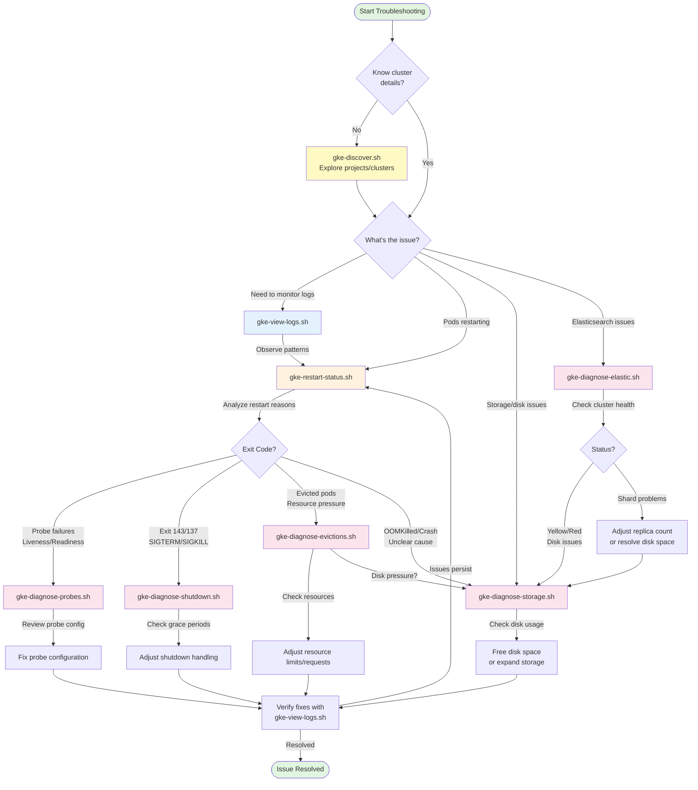

# GKE Utility Scripts

A collection of scripts for managing and diagnosing Google Kubernetes Engine (GKE) clusters.

## Table of Contents

- [About](#about)
- [Prerequisites](#prerequisites)
- [Scripts](#scripts)
  - [gke-discover.sh](#gke-discoversh)
  - [gke-view-logs.sh](#gke-view-logssh)
  - [gke-restart-status.sh](#gke-restart-statussh)
  - [gke-diagnose-probes.sh](#gke-diagnose-probessh)
  - [gke-diagnose-shutdown.sh](#gke-diagnose-shutdownsh)
  - [gke-diagnose-evictions.sh](#gke-diagnose-evictionssh)
  - [gke-diagnose-storage.sh](#gke-diagnose-storagesh)
  - [gke-diagnose-elastic.sh](#gke-diagnose-elasticsh)
  - [gcp-diagnose-load-balancer.sh](#gcp-diagnose-load-balancersh)
  - [gke-cert-check.sh](#gke-cert-checksh)
  - [gke-swagger-launch.sh](#gke-swagger-launchsh)
- [Installation](#installation)
- [Common Parameters](#common-parameters)
- [References](#references)

## About

### Purpose and Philosophy

This suite of Google Kubernetes Engine (GKE) diagnostic scripts was created to provide lightweight, focused tools for
 troubleshooting common Kubernetes issues in GKE clusters. The scripts emphasize:

- **Simplicity**: Easy to understand and modify
- **Reduced barriers to entry**: Publicly available, minimal dependencies,
- **Educational value**: Clear output that helps you understand what's happening in your cluster
- **GKE-specific optimizations**: Tailored for GKE's architecture and features
- **Integration**: Scripts work together, cross-referencing each other to guide troubleshooting workflows
- **Portability**: Pure bash scripts that work anywhere gcloud and kubectl are available

Each script targets a specific diagnostic area (pod restarts, probe failures, evictions, etc.) and can be used
 standalone or as part of an integrated troubleshooting workflow. The scripts are designed to be read and understood,
 serving as both operational tools and learning resources.

These scripts complement rather than replace other publicly available tools. Use them when you need quick, focused
 diagnostics without installing additional software, or when you want to understand the underlying kubectl commands
 being executed.

### Diagnostic Workflow


```mermaid
flowchart TD
    Start([Start Troubleshooting])
    Start --> Discover{Know cluster<br/>details?}
    
    Discover -->|No| GkeDiscover[gke-discover.sh<br/>Explore projects/clusters]
    Discover -->|Yes| Choice{What's the issue?}
    GkeDiscover --> Choice
    
    Choice -->|Need to monitor logs| ViewLogs[gke-view-logs.sh]
    Choice -->|Pods restarting| RestartStatus[gke-restart-status.sh]
    Choice -->|Storage/disk issues| Storage[gke-diagnose-storage.sh]
    Choice -->|Elasticsearch issues| Elastic[gke-diagnose-elastic.sh]
    
    ViewLogs -->|Observe patterns| RestartStatus
    
    RestartStatus -->|Analyze restart reasons| Decision{Exit Code?}
    
    Decision -->|Probe failures<br/>Liveness/Readiness| Probes[gke-diagnose-probes.sh]
    Decision -->|Exit 143/137<br/>SIGTERM/SIGKILL| Shutdown[gke-diagnose-shutdown.sh]
    Decision -->|Evicted pods<br/>Resource pressure| Evictions[gke-diagnose-evictions.sh]
    Decision -->|OOMKilled/Crash<br/>Unclear cause| Storage
    
    Elastic -->|Check cluster health| ElasticDecision{Status?}
    ElasticDecision -->|Yellow/Red<br/>Disk issues| Storage
    ElasticDecision -->|Shard problems| Fix5[Adjust replica count<br/>or resolve disk space]
    
    Probes -->|Review probe config| Fix1[Fix probe configuration]
    Shutdown -->|Check grace periods| Fix2[Adjust shutdown handling]
    Evictions -->|Check resources| Fix3[Adjust resource limits/requests]
    Evictions -->|Disk pressure?| Storage
    Storage -->|Check disk usage| Fix4[Free disk space<br/>or expand storage]
    Fix5 --> Storage
    
    Fix1 --> Verify[Verify fixes with<br/>gke-view-logs.sh]
    Fix2 --> Verify
    Fix3 --> Verify
    Fix4 --> Verify
    
    Verify -->|Issues persist| RestartStatus
    Verify -->|Resolved| End([Issue Resolved])
    
    style Start fill:#e1f5e1
    style End fill:#e1f5e1
    style GkeDiscover fill:#fff9c4
    style ViewLogs fill:#e3f2fd
    style RestartStatus fill:#fff3e0
    style Probes fill:#fce4ec
    style Shutdown fill:#fce4ec
    style Evictions fill:#fce4ec
    style Storage fill:#fce4ec
    style Elastic fill:#fce4ec
```

## Prerequisites

Before using these scripts, ensure you have the required tools installed. See [REQUIREMENTS.md](REQUIREMENTS.md) for detailed
 installation instructions.

**Core Requirements:**

- `gcloud` CLI (Google Cloud SDK)
- `kubectl` (Kubernetes command-line tool)
- `gke-gcloud-auth-plugin`

**Optional (depending on script):**

- `jq` (JSON processor)
- `xpanes` (tmux-based multi-pane viewer)
- `tmux` (terminal multiplexer)
- `openssl` (certificate utilities)
- Node.js/npm (for optional table formatting)

## Scripts

### gke-discover.sh

**Purpose:** Interactive resource discovery and command template generation for GKE clusters.

**Description:** A comprehensive discovery tool that helps you explore GCP projects, GKE clusters, namespaces, and
 Kubernetes resources with numbered selection menus. Generates ready-to-use command templates for all other GKE utility
  scripts and kubectl commands. Features caching for improved performance and auto-detection of TLS verification requirements.

**Parameters:**

| Parameter          | Short | Required | Description                                                   |
|--------------------|-------|----------|---------------------------------------------------------------|
| `--project`        | `-p`  | No       | GCP project ID (skips project selection)                      |
| `--cluster`        | `-c`  | No       | GKE cluster name (skips cluster selection)                    |
| `--zone`           | `-z`  | No       | Cluster zone (required if cluster specified)                  |
| `--region`         | `-r`  | No       | Cluster region (for regional clusters)                        |
| `--namespace`      | `-n`  | No       | Kubernetes namespace (skips namespace selection)              |
| `--interactive`    | `-i`  | No       | Launch interactive exploration mode                           |
| `--clear-cache`    |       | No       | Clear cached project/cluster data                             |
| `--verbose`        | `-v`  | No       | Enable verbose output                                         |
| `--help`           | `-h`  | No       | Show help message                                             |

**Examples:**

```bash
# Interactive mode - explore all resources with numbered menus
./gke-discover.sh --interactive

# List all projects (numbered selection)
./gke-discover.sh

# List clusters in a specific project
./gke-discover.sh -p my-project

# List namespaces in a specific cluster
./gke-discover.sh -p my-project -c my-cluster -z us-central1-a

# Generate command templates for a namespace
./gke-discover.sh -p my-project -c my-cluster -z us-central1-a -n production

# Clear cache and refresh data
./gke-discover.sh --clear-cache
```

**Features:**

- **Numbered Selection:** Choose projects, clusters, and namespaces by number instead of copy-pasting
- **Command Templates:** Generates ready-to-run commands for:
  - `gke-swagger-launch.sh`
  - `gke-view-logs.sh`
  - `gke-restart-status.sh`
  - `gke-cert-check.sh`
  - `gke-diagnose-probes.sh`
  - `gke-diagnose-evictions.sh`
  - `gke-diagnose-shutdown.sh`
  - `gke-diagnose-storage.sh`
  - `gke-diagnose-elastic.sh`
  - `kubectl` commands
- **Smart Caching:** 1-hour cache for projects and clusters (improve performance)
- **TLS Auto-Detection:** Automatically detects and includes `--insecure-skip-tls-verify` when needed
- **Interactive Mode:** Menu-driven exploration with resource browsing and filtering

**Interactive Mode Commands:**

- `1` - List all projects
- `2` - List clusters in current project
- `3` - List namespaces in current cluster
- `4` - List pods in current namespace
- `5` - List services in current namespace
- `6` - Generate command templates
- `c` - Clear cache
- `q` - Quit

---

### gke-view-logs.sh

**Purpose:** Create a tmux split-pane view of pod logs using xpanes for simultaneous monitoring of multiple pods.

**Description:** Uses xpanes to create a split-pane terminal view showing logs from all pods in a namespace. Each pod (or
 container) gets its own pane for easy parallel monitoring.

**Parameters:**

| Parameter          | Short | Required | Description                                                      |
|--------------------|-------|----------|------------------------------------------------------------------|
| `--project`        | `-p`  | Yes      | GCP project name                                                 |
| `--cluster`        | `-c`  | Yes      | GKE cluster name                                                 |
| `--zone`           | `-z`  | Yes*     | Cluster zone (for zonal clusters)                                |
| `--region`         | `-r`  | Yes*     | Cluster region (for regional clusters)                           |
| `--namespace`      | `-n`  | Yes      | Kubernetes namespace                                             |
| `--container`      | `-C`  | No       | Specific container name to tail                                  |
| `--all-containers` | `-A`  | No       | Show all containers (creates pane per container)                 |
| `--tail`           | `-t`  | No       | Number of lines to tail (default: 100)                           |
| `--since`          | `-s`  | No       | Show logs since timestamp (RFC3339 or relative like '1h', '30m') |
| `--until`          | `-u`  | No       | Show logs until timestamp (RFC3339 format)                       |
| `--no-follow`      | `-F`  | No       | Don't follow logs (default: follow)                              |
| `--auto-login`     | `-a`  | No       | Automatically run gcloud auth login                              |
| `--verbose`        | `-v`  | No       | Enable verbose output                                            |

*Either zone or region must be specified, but not both.

**Examples:**

```bash
# View logs from all pods in a namespace
./gke-view-logs.sh -p my-project -c prod-cluster -z us-central1-a -n my-namespace

# View logs from all containers in all pods
./gke-view-logs.sh -p my-project -c prod-cluster -r us-west1 -n my-namespace -A

# View logs from a specific container
./gke-view-logs.sh -p my-project -c prod-cluster -z us-east1-c -n my-namespace -C app-container

# View logs for a specific time range
./gke-view-logs.sh -p my-project -c prod-cluster -z us-east1-c -n my-namespace \
  -s 2025-01-15T10:00:00Z -u 2025-01-15T11:00:00Z

# View logs from the last hour
./gke-view-logs.sh -p my-project -c prod-cluster -z us-east1-c -n my-namespace -s 1h
```

**Navigation:**

- Use `Ctrl+B` then arrow keys to navigate between panes
- Use `Ctrl+B` then `d` to detach from tmux session

---

### gke-restart-status.sh

**Purpose:** Check pod restart status in GKE clusters.

**Description:** Connects to a GKE cluster and checks for pod restarts in the specified namespace(s). Reports pods with
 restart counts greater than 0, along with exit codes, restart reasons, and timestamps. Automatically suggests related
 diagnostic tools when issues are detected.

**Parameters:**

| Parameter          | Short | Required | Description                                     |
|--------------------|-------|----------|-------------------------------------------------|
| `--project`        | `-p`  | Yes      | GCP project name                                |
| `--cluster`        | `-c`  | Yes      | GKE cluster name                                |
| `--zone`           | `-z`  | Yes*     | Cluster zone (for zonal clusters)               |
| `--region`         | `-r`  | Yes*     | Cluster region (for regional clusters)          |
| `--namespace`      | `-n`  | No       | Kubernetes namespace (default: default)         |
| `--all-namespaces` | `-A`  | No       | Check all namespaces                            |
| `--auto-login`     | `-a`  | No       | Automatically run gcloud auth login             |
| `--verbose`        | `-v`  | No       | Enable verbose output                           |
| `--quiet`          | `-q`  | No       | Quiet mode (only show errors and results)       |

*Either zone or region must be specified, but not both.

**Examples:**

```bash
# Check restarts in default namespace
./gke-restart-status.sh -p my-project -c prod-cluster -z us-central1-a

# Check restarts in a specific namespace
./gke-restart-status.sh -p my-project -c dev-cluster -r us-west1 -n my-namespace

# Check restarts in all namespaces
./gke-restart-status.sh -p my-project -c prod-cluster -z us-east1-c -A

# Run with auto-login
./gke-restart-status.sh -p my-project -c test-cluster -r us-central1 -a
```

**Related Tools:**
When high restart counts are detected, this script automatically suggests running:

- `gke-diagnose-probes.sh` for probe failures
- `gke-diagnose-shutdown.sh` for shutdown issues
- `gke-diagnose-evictions.sh` for pod evictions

---

### gke-diagnose-probes.sh

**Purpose:** Diagnose liveness, readiness, and startup probe failures.

**Description:** Analyzes probe configurations and failures in GKE clusters. Detects anti-patterns such as using the same
 endpoint for multiple probe types, and provides detailed recommendations for fixing probe issues.

**Parameters:**

| Long Form          | Short | Required | Description                                    |
|--------------------|-------|----------|------------------------------------------------|
| `--project`        | `-p`  | Yes      | GCP project ID                                 |
| `--cluster`        | `-c`  | Yes      | GKE cluster name                               |
| `--zone`           | `-z`  | Yes*     | Cluster zone (for zonal clusters)              |
| `--region`         | `-r`  | Yes*     | Cluster region (for regional clusters)         |
| `--namespace`      | `-n`  | No       | Specific namespace to check (default: all)     |
| `--all-namespaces` | `-a`  | No       | Check all namespaces explicitly                |
| `--verbose`        | `-v`  | No       | Enable verbose output                          |
| `--quiet`          | `-q`  | No       | Quiet mode (minimal output)                    |
| `--auto-login`     | `-l`  | No       | Auto-login to gcloud if not authenticated      |
| `--help`           | `-h`  | No       | Show help message                              |

*Either zone or region must be specified, but not both.

**Examples:**

```bash
# Check probe failures in all namespaces
./gke-diagnose-probes.sh -p my-project -c my-cluster -z us-east4-a

# Check probe failures in a specific namespace with verbose output
./gke-diagnose-probes.sh -p my-project -c my-cluster -r us-east4 -n production -v

# Check with auto-login
./gke-diagnose-probes.sh -p my-project -c my-cluster -z us-east4-a -l
```

**What It Detects:**

- Liveness probe failures
- Readiness probe failures
- Startup probe failures
- Anti-patterns (e.g., same endpoint for multiple probe types)
- Misconfigured probe settings

---

### gke-diagnose-shutdown.sh

**Purpose:** Diagnose ungraceful shutdown issues (SIGTERM/SIGKILL).

**Description:** Analyzes pods that were terminated with SIGTERM (exit code 143) or SIGKILL (exit code 137). Checks grace
 periods, preStop hooks, and provides recommendations for ensuring graceful shutdowns.

**Parameters:**

| Long Form            | Short | Required | Description                                |
|----------------------|-------|----------|--------------------------------------------|
| `--project`          | `-p`  | Yes      | GCP project ID                             |
| `--cluster`          | `-c`  | Yes      | GKE cluster name                           |
| `--zone`             | `-z`  | Yes*     | Cluster zone (for zonal clusters)          |
| `--region`           | `-r`  | Yes*     | Cluster region (for regional clusters)     |
| `--namespace`        | `-n`  | No       | Specific namespace to check (default: all) |
| `--all-namespaces`   | `-a`  | No       | Check all namespaces explicitly            |
| `--verbose`          | `-v`  | No       | Enable verbose output                      |
| `--quiet`            | `-q`  | No       | Quiet mode (minimal output)                |
| `--auto-login`       | `-l`  | No       | Auto-login to gcloud if not authenticated  |
| `--help`             | `-h`  | No       | Show help message                          |

*Either zone or region must be specified, but not both.

**Examples:**

```bash
# Check shutdown issues in all namespaces
./gke-diagnose-shutdown.sh -p my-project -c my-cluster -z us-east4-a

# Check shutdown issues in a specific namespace
./gke-diagnose-shutdown.sh -p my-project -c my-cluster -r us-east4 -n production

# Check with verbose output
./gke-diagnose-shutdown.sh -p my-project -c my-cluster -z us-east4-a -a -v
```

**What It Detects:**

- SIGTERM (143) terminations
- SIGKILL (137) terminations
- Insufficient grace periods
- Missing preStop hooks
- Graceful shutdown implementation issues

---

### gke-diagnose-storage.sh

**Purpose:** Diagnose storage and disk space issues in GKE clusters.

**Description:** Analyzes PersistentVolumeClaims (PVCs), pod disk usage, node disk pressure, and storage-related issues
 in GKE clusters. Provides warnings when disk usage exceeds 80% and recommendations for remediation. Particularly useful
  for diagnosing Elasticsearch and other stateful application storage issues.

**Parameters:**

| Parameter          | Short | Required | Description                                                   |
|--------------------|-------|----------|---------------------------------------------------------------|
| `--project`        | `-p`  | Yes      | GCP project ID                                                |
| `--cluster`        | `-c`  | Yes      | GKE cluster name                                              |
| `--zone`           | `-z`  | Yes*     | Cluster zone (for zonal clusters)                             |
| `--region`         | `-r`  | Yes*     | Cluster region (for regional clusters)                        |
| `--namespace`      | `-n`  | No       | Specific namespace to check (default: all namespaces)         |
| `--pod`            | `-d`  | No       | Specific pod to diagnose (requires --namespace)               |
| `--all-namespaces` | `-a`  | No       | Check all namespaces explicitly                               |
| `--verbose`        | `-v`  | No       | Enable verbose output                                         |
| `--quiet`          | `-q`  | No       | Quiet mode (minimal output)                                   |
| `--auto-login`     | `-l`  | No       | Auto-login to gcloud if not authenticated                     |
| `--help`           | `-h`  | No       | Show help message                                             |

*Either zone or region must be specified, but not both.

**Examples:**

```bash
# Check storage in all namespaces
./gke-diagnose-storage.sh -p my-project -c my-cluster -z us-east4-a

# Check storage in a specific namespace
./gke-diagnose-storage.sh -p my-project -c my-cluster -r us-east4 -n elastic

# Detailed diagnosis of a specific pod
./gke-diagnose-storage.sh -p my-project -c my-cluster -z us-east4-a -n elastic -d elasticsearch-master-0

# Check with verbose output
./gke-diagnose-storage.sh -p my-project -c my-cluster -z us-east4-a -a -v
```

**What It Detects:**

- PVC capacity and usage
- Pod disk usage (via `df -h` in containers)
- Node disk pressure conditions
- High disk usage warnings (≥80%)
- Pending pods due to storage issues
- Storage class configurations

**Critical Warnings:**

- **Red Flag (≥80% usage):** Displays CRITICAL warning with affected pods
- **Actionable recommendations:** Suggests deleting old data, increasing PVC size, or reviewing retention policies
- **Context-aware:** Notes that Elasticsearch refuses allocations at 85% (low watermark)

**Use Cases:**

- Troubleshooting Elasticsearch cluster formation failures
- Investigating pod evictions due to disk pressure
- Planning storage capacity upgrades
- Monitoring stateful application storage health

---

### gke-diagnose-elastic.sh

**Purpose:** Comprehensive diagnostics for Elasticsearch clusters running in GKE.

**Description:** Performs detailed health checks and diagnostics specifically for Elasticsearch deployments in GKE. 
Analyzes cluster health, node status, shard allocation, index health, disk usage, and recent error logs. Includes 
secure credential management with encrypted caching to avoid exposing passwords on the command line. Provides 
actionable recommendations based on findings.

**Parameters:**

| Parameter      | Short | Required | Description                                                     |
|----------------|-------|----------|-----------------------------------------------------------------|
| `--project`    | `-p`  | Yes      | GCP project ID                                                  |
| `--cluster`    | `-c`  | Yes      | GKE cluster name                                                |
| `--zone`       | `-z`  | Yes*     | Cluster zone (for zonal clusters)                               |
| `--region`     | `-r`  | Yes*     | Cluster region (for regional clusters)                          |
| `--namespace`  | `-n`  | Yes      | Kubernetes namespace containing Elasticsearch                   |
| `--pod`        | `-d`  | No       | Specific Elasticsearch pod name (default: first master pod)     |
| `--secret`     | `-s`  | No       | Kubernetes secret containing Elasticsearch credentials          |
| `--verbose`    | `-v`  | No       | Verbose output (includes full log lines with all fields)        |
| `--quiet`      | `-q`  | No       | Quiet mode (minimal output)                                     |
| `--auto-login` | `-l`  | No       | Auto-login to gcloud if not authenticated                       |
| `--help`       | `-h`  | No       | Show help message                                               |

*Either zone or region must be specified, but not both.

**Examples:**

```bash
# Basic diagnostics for Elasticsearch cluster
./gke-diagnose-elastic.sh -p my-project -c my-cluster -z us-east4-a -n elastic

# Use regional cluster
./gke-diagnose-elastic.sh --project my-project --cluster my-cluster --region us-east4 --namespace elastic

# Diagnose specific pod
./gke-diagnose-elastic.sh -p my-project -c my-cluster -z us-east4-a -n elastic -d elasticsearch-master-0

# Use specific Kubernetes secret for credentials
./gke-diagnose-elastic.sh -p my-project -c my-cluster -z us-east4-a -n elastic --secret elasticsearch-master-credentials

# Verbose mode with full log details
./gke-diagnose-elastic.sh -p my-project -c my-cluster -z us-east4-a -n elastic -v
```

**What It Checks:**

1. **Pod Status** - Verifies all Elasticsearch pods are running and ready
2. **Cluster Health** - Queries Elasticsearch `/_cluster/health` API (green/yellow/red status)
3. **Node Information** - Displays heap usage, disk usage, CPU, and memory for each node
4. **Shard Allocation** - Identifies unassigned shards and provides allocation explanations
5. **Indices** - Lists top 10 indices by size with health status
6. **Cluster Settings** - Shows disk watermark thresholds (low/high/flood stage)
7. **Error Logs** - Parses recent pod logs for errors, showing timestamp and message by default
8. **Summary** - Provides overall health assessment and actionable recommendations

**Credential Management:**

The script implements secure credential handling:

- **No passwords on command line** - Credentials are never passed as CLI arguments
- **Interactive prompts** - Securely prompts for username/password with masked input
- **Encrypted caching** - Stores credentials encrypted using AES-256-CBC in `~/.cache/gke-elastic/`
- **30-day expiry** - Cached credentials automatically expire after 30 days
- **Machine-specific encryption** - Uses hostname and UID for encryption key derivation
- **Automatic discovery** - Attempts to find credentials from common Kubernetes secrets

The script will try the following credential sources in order:
1. Cached credentials (if valid)
2. Specified secret (`--secret` flag)
3. Common secret names (`elasticsearch-master-credentials`, `elastic-credentials`)
4. Interactive prompt (with caching for future use)

**Critical Warnings:**

- **🔴 Red Status:** Cluster in red state (primary shards unassigned)
- **⚠️ Yellow Status:** Cluster degraded (replica shards unassigned)
- **⚠️ High Disk Usage:** Nodes with ≥80% disk usage (Elasticsearch default watermark is 85%)
- **⚠️ High Heap Usage:** Nodes with ≥90% heap utilization

**Log Parsing:**

By default, the script shows only timestamp and message from error logs for cleaner output:
```
[2026-01-08T05:17:59.204Z] failed to retrieve database [GeoLite2-ASN.mmdb]
```

With `--verbose`, you'll see complete log entries with all JSON fields including stack traces.

**Use Cases:**

- Diagnosing cluster status issues (yellow/red health)
- Investigating shard allocation failures
- Monitoring disk space before hitting Elasticsearch watermarks
- Troubleshooting pod startup problems
- Analyzing recent errors in Elasticsearch logs
- Planning index lifecycle management

**Common Findings:**

- **Disk Space Issues:** Elasticsearch has strict watermarks (85% low, 90% high, 95% flood stage)
- **Unassigned Shards:** Often caused by disk space, replica count mismatches, or node failures
- **GeoIP Database Errors:** Common during cluster initialization, usually resolve automatically
- **Heap Pressure:** Indicates need to adjust JVM settings or add nodes

---

### gcp-diagnose-load-balancer.sh

**Purpose:** Diagnose Google Cloud Load Balancer frontends, certificates, and backend wiring from a hostname and/or IP address.

**Description:** Inspects Compute Engine forwarding rules and traces them through target proxies, URL maps, backend services, and SSL certificates.
Helps identify frontend type, supported protocols, certificate management model (Google-managed vs self-managed), SAN/domain coverage, and common misconfigurations.

**Parameters:**

| Parameter             | Short | Required | Description                                                       |
|-----------------------|-------|----------|-------------------------------------------------------------------|
| `--project`           | `-p`  | Yes      | GCP project ID                                                    |
| `--hostname`          | `-H`  | No*      | Hostname to analyze (for URL map host rules and cert validation) |
| `--ip`                | `-i`  | No*      | Frontend IP address to analyze                                    |
| `--region`            | `-r`  | No       | Restrict checks to a specific region                              |
| `--list-all`          |       | No       | Analyze all forwarding rules in the project                       |
| `--verbose`           | `-v`  | No       | Verbose output                                                    |
| `--quiet`             | `-q`  | No       | Quiet mode                                                        |
| `--auto-login`        | `-l`  | No       | Auto-login with `gcloud auth login` if needed                     |
| `--help`              | `-h`  | No       | Show help message                                                 |

*Provide at least one of `--hostname` or `--ip`, unless using `--list-all`.

**Examples:**

```bash
# Diagnose by hostname
./gcp-diagnose-load-balancer.sh -p my-project -H api.example.com

# Diagnose by IP
./gcp-diagnose-load-balancer.sh -p my-project -i 34.123.45.67

# Diagnose by both hostname and IP
./gcp-diagnose-load-balancer.sh -p my-project -H api.example.com -i 34.123.45.67

# Analyze all forwarding rules in a region
./gcp-diagnose-load-balancer.sh -p my-project --list-all -r us-central1
```

**What It Checks:**

1. **Frontend Identification** - Forwarding rule details, load balancing scheme, network tier, target type
2. **Protocol Verification** - IP protocol and inferred frontend protocols (HTTP/HTTPS/SSL/TCP/gRPC)
3. **Certificate Diagnostics** - Managed status, expiry, SAN/domain coverage for requested hostname
4. **Certificate Map Deep Inspection** - Certificate Manager map entries, hostname pattern matching, mapped cert state/SANs
5. **CA Trust and Chain Analysis** - Live TLS trust verification code, certificate chain continuity, issuer/subject and CA flags
6. **Domain/Host Mapping** - URL map host rule matching and optional DNS A-record checks
7. **Backend Wiring** - URL map backend services, backend service protocol/timeout/session affinity/logging
8. **Health Check Presence** - Lists configured health checks for each backend service

**Output Legend:**

- `✅` check completed successfully with no issue for that item
- `⚠️` warning condition detected (non-critical)
- `❗️` critical certificate finding detected (high priority)

**Use Cases:**

- Troubleshooting hostname-to-load-balancer routing mismatches
- Investigating certificate trust and domain coverage issues
- Verifying frontend listener protocol expectations
- Confirming backend service and health-check configuration

---

### gke-cert-check.sh

**Purpose:** Check SSL/TLS certificates stored in GKE secrets.

**Description:** Connects to a GKE cluster and examines TLS certificates stored in Kubernetes secrets. Displays
 certificate information including expiration dates, subject details, and issuer information. Can check a specific secret
 or list all certificates in a namespace.

**Parameters:**

| Parameter           | Short | Required | Description                                      |
|---------------------|-------|----------|--------------------------------------------------|
| `--project`         | `-p`  | Yes      | GCP project name                                 |
| `--cluster`         | `-c`  | Yes      | GKE cluster name                                 |
| `--zone`            | `-z`  | Yes      | Cluster zone                                     |
| `--namespace`       | `-n`  | No       | Kubernetes namespace (default: default)          |
| `--secret`          | `-s`  | No       | Specific secret name to check                    |
| `--format`          | `-f`  | No       | Output format: human\|json\|list (default: human)|
| `--auto-login`      | `-a`  | No       | Automatically run gcloud auth login              |
| `--skip-cert-check` | `-k`  | No       | Skip cluster certificate verification            |
| `--verify`          | `-V`  | No       | Perform additional certificate verification      |
| `--verbose`         | `-v`  | No       | Enable verbose output                            |
| `--quiet`           | `-q`  | No       | Quiet mode (only show errors)                    |

**Examples:**

```bash
# Check all certificates in default namespace
./gke-cert-check.sh -p my-project -c prod-cluster -z us-central1-a

# Check certificates in a specific namespace
./gke-cert-check.sh -p my-project -c dev-cluster -z us-west1-b -n istio-system

# Check a specific secret with verbose output
./gke-cert-check.sh -p my-project -c prod-cluster -z us-east1-c -s my-tls-secret -v

# Output in JSON format
./gke-cert-check.sh -p my-project -c prod-cluster -z us-central1-a -f json

# Run with auto-login
./gke-cert-check.sh -p my-project -c test-cluster -z us-central1-a -a
```

**Certificate Information Displayed:**

- Certificate subject
- Issuer
- Validity period (start/end dates)
- Days until expiration
- Serial number
- Alternative names (SANs)

---

### gke-swagger-launch.sh

**Purpose:** Launch Swagger UI via GKE port forwarding.

**Description:** Sets up port forwarding to a Kubernetes service running an application that supports OpenAPI / Swagger
 UI, and opens the Swagger UI API documentation in a browser window. This simplifies access to API documentation privately
 hosted in GKE clusters for internal developers. Includes service endpoint validation and connection verification to ensure
 successful port forwarding.

**Note**: This script should <ins>not</ins> be used as means for sharing API documentation with external teams, as it
 would require you to provision environment access to your API consumers.

**Parameters:**

| Parameter        | Short | Required | Description                                              |
|------------------|-------|----------|----------------------------------------------------------|
| `--project`      | `-p`  | Yes      | GCP project ID                                           |
| `--cluster`      | `-c`  | Yes      | GKE cluster name                                         |
| `--zone`         | `-z`  | Yes*     | Zone for zonal cluster (use `--zone` or `--region`)      |
| `--region`       | `-r`  | Yes*     | Region for regional cluster (use `--zone` or `--region`) |
| `--service`      | `-s`  | Yes      | Kubernetes service name                                  |
| `--namespace`    | `-n`  | Yes      | Kubernetes namespace                                     |
| `--local-port`   | `-l`  | No       | Local port for forwarding (default: 8080)                |
| `--remote-port`  | `-R`  | No       | Remote port for forwarding (default: 8080)               |
| `--swagger-path` |       | No       | Path to Swagger UI (default: /swagger-ui/index.html)     |
| `--http`         |       | No       | Use HTTP instead of HTTPS (default: HTTPS)               |

*Either zone or region must be specified, but not both.

**Examples:**

```bash
# Launch Swagger UI with defaults (zonal cluster)
./gke-swagger-launch.sh -p my-project -c my-cluster -z us-central1-a -s my-service -n my-namespace

# Regional cluster
./gke-swagger-launch.sh -p my-project -c my-cluster -r us-central1 -s my-service -n my-namespace

# Use custom ports
./gke-swagger-launch.sh -p my-project -c my-cluster -z us-central1-a -s my-service -n my-namespace -l 9090

# Use HTTP instead of HTTPS
./gke-swagger-launch.sh -p my-project -c my-cluster -z us-central1-a -s my-service -n my-namespace --http

# Custom Swagger path
./gke-swagger-launch.sh -p my-project -c my-cluster -z us-central1-a -s my-service -n my-namespace \
  --swagger-path /api/swagger/index.html
```

**What It Does:**

1. Authenticates with Google Cloud
2. Sets the active GCP project
3. Gets cluster credentials and sets kubectl context
4. Validates service endpoints and availability
5. Sets up port forwarding to the specified service
6. Verifies the port forward connection
7. Opens Swagger UI in the default browser

---

### gke-diagnose-evictions.sh

**Purpose:** Diagnose pod eviction issues.

**Description:** Analyzes pod evictions in GKE clusters, checking for node pressure conditions, resource quotas, and Pod
Disruption Budgets (PDBs). Helps identify why pods are being evicted and provides remediation suggestions.

**Parameters:**

| Long Form            | Short| Required | Description                                |
|----------------------|------|----------|--------------------------------------------|
| `--project`          | `-p` | Yes      | GCP project ID                             |
| `--cluster`          | `-c` | Yes      | GKE cluster name                           |
| `--zone`             | `-z` | Yes      | Cluster zone                               |
| `--namespace`        | `-n` | No       | Specific namespace to check (default: all) |
| `--all-namespaces`   | `-a` | No       | Check all namespaces explicitly            |
| `--verbose`          | `-v` | No       | Enable verbose output                      |
| `--quiet`            | `-q` | No       | Quiet mode (minimal output)                |
| `--auto-login`       | `-l` | No       | Auto-login to gcloud if not authenticated  |
| `--help`             | `-h` | No       | Show help message                          |

**Examples:**

```bash
# Check evictions in all namespaces
./gke-diagnose-evictions.sh -p my-project -c my-cluster -z us-east4-a

# Check evictions in a specific namespace
./gke-diagnose-evictions.sh -p my-project -c my-cluster -z us-east4-a -n production

# Check with verbose output
./gke-diagnose-evictions.sh -p my-project -c my-cluster -z us-east4-a -a -v
```

**What It Detects:**

- Pod evictions due to node pressure
- Resource quota violations
- Pod Disruption Budget issues
- Memory/CPU pressure
- Disk pressure

---

## Installation

1. **Clone or download the scripts** to your local machine.

2. **Make scripts executable:**

   ```bash
   chmod +x *.sh
   ```

3. **Install prerequisites** (see [REQUIREMENTS.md](REQUIREMENTS.md) for detailed instructions):

   ```bash
   # macOS
   brew install google-cloud-sdk kubectl jq xpanes tmux
   
   # Linux (Ubuntu/Debian)
   # Follow instructions in REQUIREMENTS.md
   ```

4. **Configure Google Cloud authentication:**

   ```bash
   gcloud auth login
   gcloud config set project YOUR_PROJECT_ID
   ```

## Common Parameters

Most scripts share these common parameters:

- **Project identification:** `-p` or `--project` (GCP project name)
- **Cluster identification:** `-c` or `--cluster` (GKE cluster name)
- **Location:** `-z`/`--zone` for zonal clusters OR `-r`/`--region` for regional clusters
- **Namespace:** `-n` or `--namespace` (Kubernetes namespace)
- **Output control:**
  - `-v` or `--verbose` (detailed output)
  - `-q` or `--quiet` (minimal output)
- **Authentication:** `-a` or `--auto-login` (automatically trigger gcloud login)

## Tips and Best Practices

1. **Use verbose mode** (`-v`) when troubleshooting script issues
2. **Use quiet mode** (`-q`) when running scripts in automation/CI pipelines
3. **Regional vs Zonal clusters:** Make sure to use `-r` for regional clusters and `-z` for zonal clusters
4. **Authentication:** Run `gcloud auth login` before using scripts, or use the `-a` flag
5. **Permissions:** Ensure your GCP account has appropriate permissions to access clusters and namespaces

## Troubleshooting

If you encounter issues:

1. Check that all prerequisites are installed (see [REQUIREMENTS.md](REQUIREMENTS.md))
2. Verify you're authenticated: `gcloud auth list`
3. Verify cluster access: `kubectl get nodes`
4. Run with `-v` flag for detailed output
5. Check the script's help: `./script-name.sh -h`

## Related Documentation

- [REQUIREMENTS.md](REQUIREMENTS.md) - Detailed installation and setup instructions
- [Google Kubernetes Engine Documentation](https://cloud.google.com/kubernetes-engine/docs)
- [kubectl Documentation](https://kubernetes.io/docs/reference/kubectl/)

## References

### Similar Tools and Alternatives

While these scripts provide focused GKE diagnostics, you might also consider these complementary tools:

**Log Viewing:**

- **stern** - Advanced log tailing with pod selection, multi-pod streaming, and colorized output
- **kubetail** - Aggregate logs from multiple pods into a single stream
- **k9s** - Full-featured terminal UI for Kubernetes with live log viewing

**Cluster Management:**

- **k9s** - Interactive terminal UI for managing Kubernetes clusters with resource browsing and shell access
- **Lens** - Desktop application providing a complete Kubernetes IDE experience
- **kubectl plugins** - Extend kubectl with custom commands (krew plugin manager)
- **kubectx/kubens** - Fast context and namespace switching for kubectl

**Diagnostics and Health:**

- **Popeye** - Kubernetes cluster sanitizer that scans for issues and best practice violations
- **kubectl-debug** - Debug running pods with ephemeral containers
- **kube-capacity** - Overview of resource requests, limits, and utilization

**Storage and Disk Analysis:**

- **kubectl df-pv** - Show disk usage of PersistentVolumes (krew plugin)
- **kubectl-view-allocations** - Display resource allocations per namespace
- **goldpinger** - Kubernetes network monitoring tool that can help identify node issues affecting storage

**Elasticsearch Management:**

- **Cerebro** - Web admin tool for Elasticsearch with cluster health visualization and index management
- **ElasticHQ** - Elasticsearch management and monitoring application
- **Elasticvue** - Elasticsearch GUI for browser-based cluster management
- **elasticsearch-head** - Web front-end for Elasticsearch cluster monitoring
- **Elastic's Support Diagnostics** - Official Elasticsearch diagnostic and support utility

**Certificate Management:**

- **cert-manager** - Automated certificate management in Kubernetes
- **kubessl** - SSL certificate inspection and management

**What Makes These Scripts Different:**

- **Lightweight**: No installation required beyond standard tools (gcloud, kubectl)
- **GKE-focused**: Optimized for GKE's specific behaviors and features
- **Educational**: Verbose output explains what's being checked and why
- **Integrated workflow**: Scripts suggest next steps and cross-reference each other
- **Customizable**: Easy to read and modify bash scripts for your specific needs

## License

These scripts are provided as-is for use with Google Kubernetes Engine clusters.
